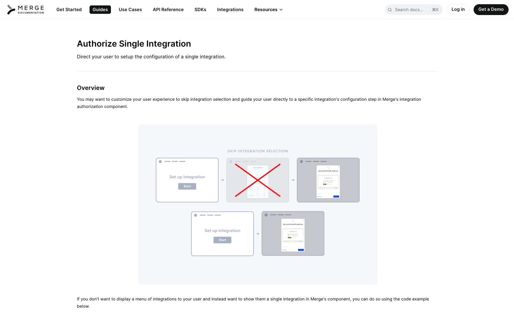
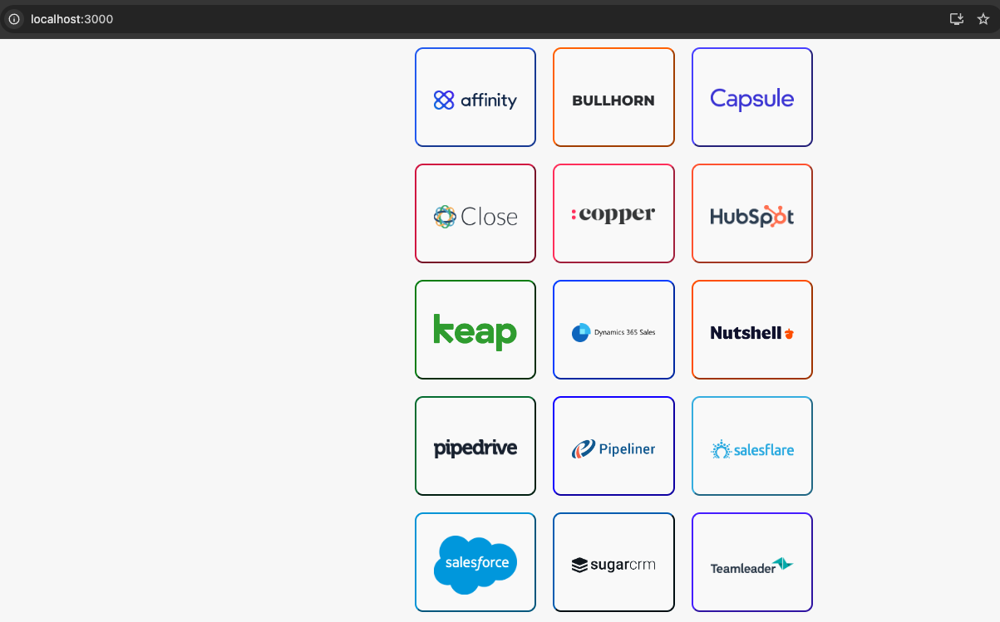

# Sample Single Integration using Merge Link

This project shows a very basic implementation of @mergeapi/react-merge-link in a [Single Integration format](https://docs.merge.dev/guides/merge-link/single-integration/).



## Getting Started

1. Install dependencies

```bash
npm install
```

2. To use, you need to update the `API_KEY` and `category` in [constants.js](./src/constants.js)

3. Start server

```bash
npm start
```

4. Open [http://localhost:3000/](http://localhost:3000/) in your broswer


